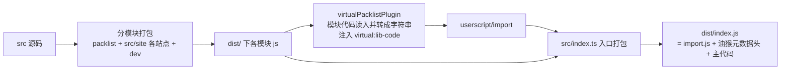

# AGENTS.md

## 项目概览

ComicReadScript 是一个油猴脚本，为漫画站、图站等网站提供功能统一的漫画阅读器和大量专属增强功能，让用户可以在不同网站上使用同一个功能丰富的阅读器浏览图片并改善网站的使用体验。项目以三种形态发布：

1. **油猴脚本**（主产物）：构建后输出 `ComicRead.user.js`，在适配的网站上运行
2. **PWA**（[src/pwa](src/pwa)）：让用户直接阅读本地的图片
3. **UMD 模块**（[src/umd.tsx](src/umd.tsx)）：打包成 `ComicReader.umd.js` 供其他开源项目集成，用法见 [docs/NPM 模块.md](docs/NPM%20模块.md)

技术栈：SolidJS + TypeScript，使用 rolldown 打包。

## 核心架构：按需加载的模块系统

脚本会在**所有网页**上运行，但绝大多数网页与脚本无关。为减少无关网页上的运行消耗，大部分代码被拆分为独立模块：

- 每个模块单独打包输出到 [dist/](dist/) 下的 `dist/<模块名>.js`
- 打包时模块代码被转成**字符串**存入 `libCodeMap`（浏览器无需解析这些代码），仅需要时才通过 `selfImport` / `require` 动态加载执行（实现见 [src/userscript/import.ts](src/userscript/import.ts)，**无需深究**，当作动态导入理解即可）
- 因此**模块之间禁止通过相对路径或子模块路径导入**，必须使用固定的模块名导入，确保依赖不会被内联，而是引用已打包好的模块

## 构建流程

构建入口为 [scripts/build.ts](scripts/build.ts)，完整流程见下图（具体实现细节无需深究）：

> [dist/index.js](dist/index.js) 非常大，不要直接全量读取。

另外还有两个构建变体（[scripts/additional-variants.ts](scripts/additional-variants.ts)）：

- **AdGuard 变体**：仅支持适配站点运行（移除简易阅读模式）
- **UMD 包**：使用 `umdPacklist` 构建，并把 CDN 资源内联进 `libCodeMap`，使产物完全自包含

## 导入规则

模块通过固定模块名导入（模块名即 `src/` 下的路径，如 `src/helper/index.ts` → `helper`），完整清单见 [scripts/lib/packlist.json](scripts/lib/packlist.json)。**正常编写代码即可**，误用相对路径或子模块形式导入时，lint 会警告并自动修复为模块名（[oxlint.config.ts](oxlint.config.ts) 的 restricted-relative-imports 规则）。

## 目录结构

| 目录                               | 职责                                                                                                                                                                                                                                 |
| ---------------------------------- | ------------------------------------------------------------------------------------------------------------------------------------------------------------------------------------------------------------------------------------ |
| [src/index.ts](src/index.ts)       | 核心入口。简单站点的适配代码直接写在这里；复杂站点通过 `selfImport('site/xxx')` 加载模块                                                                                                                                             |
| [src/site/](src/site/)             | 复杂站点的适配代码，每个站点独立打包为一个模块                                                                                                                                                                                       |
| [src/helper/](src/helper/)         | 通用 helper 代码，强调通用性                                                                                                                                                                                                         |
| [src/userscript/](src/userscript/) | 油猴脚本特有模块（core、detectAd、copyApi、otherSite、ehTagRules 等），其中部分特定网站专用的代码只是为了打包成模块才放在这里                                                                                                        |
| [src/worker/](src/worker/)         | 适合放进 worker 运行的代码（detectAd、ImageRecognition、ImageUpscale）。优先在 worker 中运行，但部分网站禁用 worker 时会降级为普通模块在主线程调用，保证功能可用（见 [src/userscript/import.ts](src/userscript/import.ts#L59-L105)） |
| [src/components/](src/components/) | 各类 UI 组件；[components/Manga](src/components/Manga) 是最重要的阅读器，大部分状态集中在 `store/` 管理，具体逻辑集中在 `actions/`                                                                                                   |
| [src/pwa/](src/pwa/)               | PWA 网站代码                                                                                                                                                                                                                         |
| [src/umd.tsx](src/umd.tsx)         | UMD 包入口                                                                                                                                                                                                                           |
| [src/stories/](src/stories/)       | UI 组件展示兼测试，配合 percy 做视觉回归                                                                                                                                                                                             |
| [scripts/](scripts/)               | 构建相关代码                                                                                                                                                                                                                         |
| [dist/](dist/)                     | 构建产物                                                                                                                                                                                                                             |

## Manga 阅读器结构

核心阅读器 [components/Manga](src/components/Manga) 按目录划分职责，改动阅读器逻辑时按功能定位文件：

- `store/`：全部状态。[store/index.ts](src/components/Manga/store/index.ts) 聚合 5 个状态模块并用 `useStore` 创建 `store`/`setState`（还导出 DOM 引用集合 `refs`）：
  - `option.ts`（用户配置：方向、填充、缩放、翻译选项等）、`image.ts`（图片数据与加载状态）、`show.ts`（显示状态：页数、移动端、网格模式等）、`prop.ts`（外部注入的回调：onExit/onPrev/onNext、快捷键）、`other.ts`（标题、全屏、自动滚动等运行状态）
- `actions/`：全部逻辑，按功能分文件（`turnPage` 翻页、`scroll*` 滚动、`zoom` 缩放、`image*` 图片加载/识别/放大、`translation` 翻译、`show`/`switch` 显隐切换等），[actions/index.ts](src/components/Manga/actions/index.ts) 统一导出
- `components/`：阅读器 UI（图片、工具栏、设置面板、滚动条等）
- `hooks/`：通用 hooks

## UI 文案与 i18n

- [src/components/](src/components/) 通用 UI 组件中展示的所有文字都必须通过 `t('key')` 获取（[src/helper/i18n.ts](src/helper/i18n.ts)），文案 key 与内容维护在 [locales/](locales/) 下的 json 文件（zh.json 为默认，en/ru 等为翻译），支持 `{{变量}}` 占位符。该约定由 oxlint 的 `i18next/no-literal-string` 规则辅助检查（仅检查 JSX 中的文案，`t()` 调用豁免）
- [src/site/](src/site/) 站点专属功能的文案**不需要** i18n，直接硬编码，但应与站点本身语言保持一致（如 ehentai 用英文、copymanga 用繁中），避免与站点观感割裂

## 常用命令

- `pnpm check`：**每次修改代码后必须运行**（`tsc -noEmit && oxlint -f stylish --fix . && oxfmt . && stylelint`），确保没有 ts、lint 错误
- 其余命令由开发者手动运行，AI 不应执行：`pnpm dev`（开发者保持运行的调试环境）、`pnpm build`（会清空并重建 dist，与运行中的 dev 冲突，破坏调试环境）、`pnpm wdio`（E2E 耗时很长）、`pnpm release`（会 git 提交、发布）
- `pnpm test`：仅当修改了测试相关文件（`src/**/*.test.ts`、`test/`）时运行；发布流程会自动执行 check 和 test
